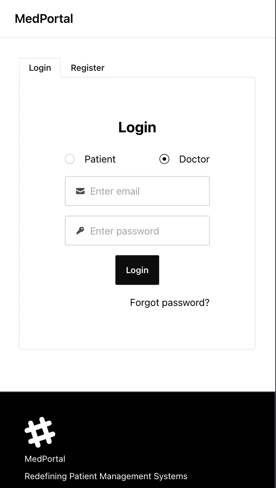
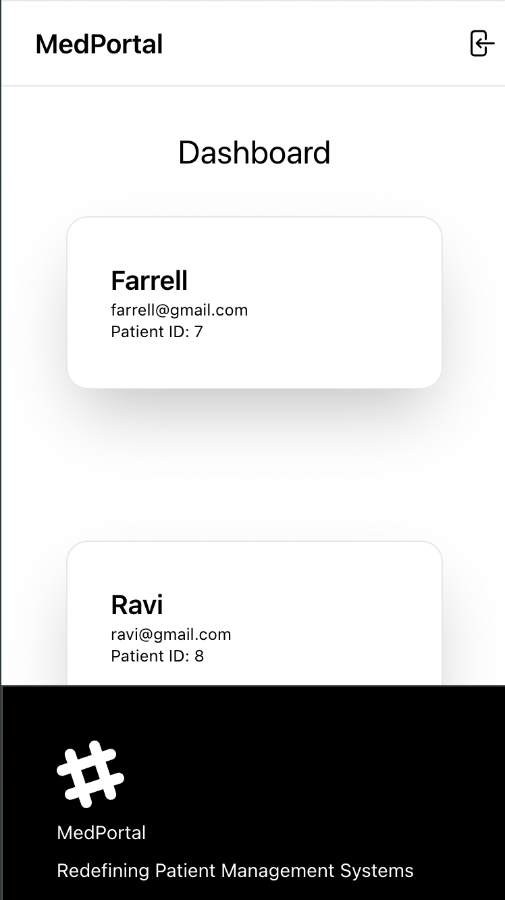
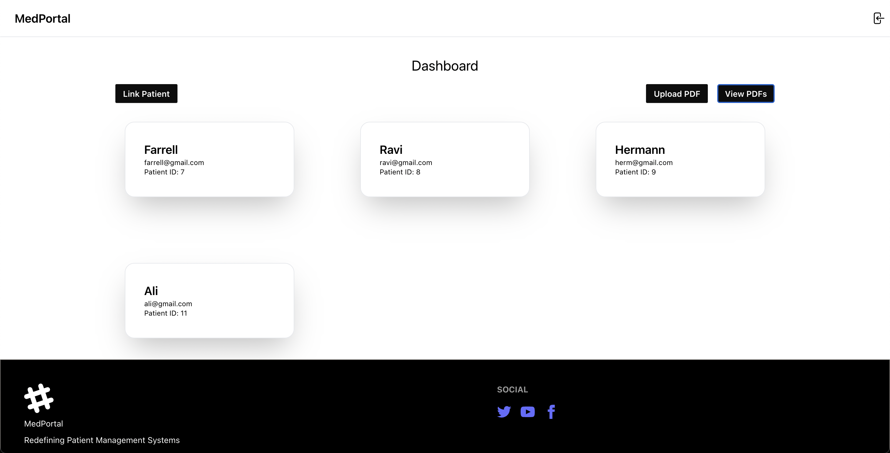
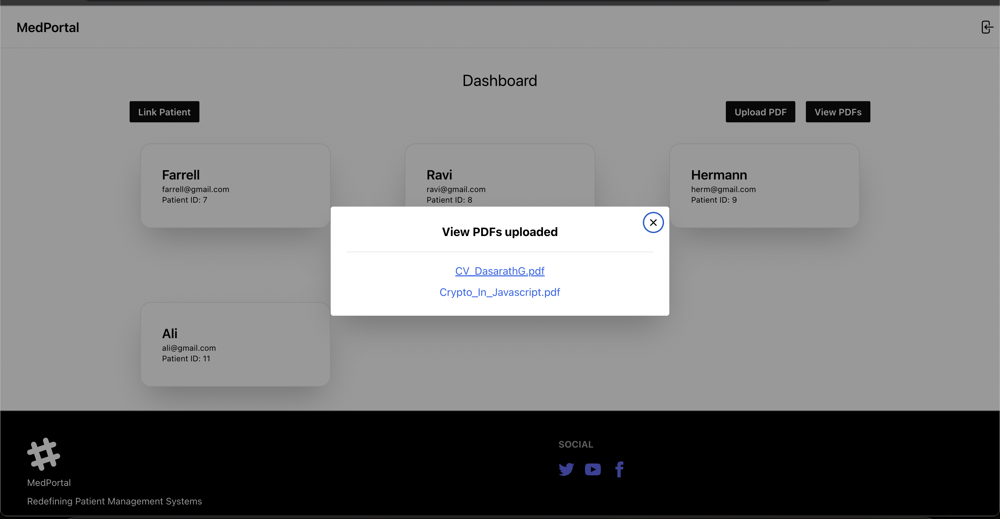

# MedPortal

This project provides a comprehensive portal for doctors, enabling them to sign up, log in, upload PDF files, and link their profiles with patient profiles. The project utilizes modern technologies for both the frontend and backend, ensuring secure and efficient data handling.

## Technology Stack

- **Frontend**: React with Vite, DaisyUI, Tailwind CSS
- **Backend**: Node.js, Prisma
- **Database**: PostgreSQL hosted on Aiven
- **Storage**: AWS S3

## Demo

Video Demo: https://www.loom.com/share/8194696d5a944b388822d9d175432021?sid=4f577429-f7bd-413b-a8ad-f43127f4ac74


<br/>
<br/>

<br/>
<br/>

<br/>
<br/>


<br/>
<br/>



## Features

1. **Account Creation and Login Portal**

   - Doctors can sign up by entering their name, email, password, and specialty.
   - Existing users can log in using their email and password.
   - Input data validation (e.g., email format, password strength).
   - Secure storage of doctor’s information in a PostgreSQL database.

2. **PDF Upload Functionality**

   - Logged-in doctors can upload PDF files.
   - Uploaded PDFs are stored in Amazon S3.
   - Uploaded PDFs are associated with the logged-in doctor in the database.

3. **Linking Doctor Profiles with Patient Profiles**
   - Doctors can link their profiles with patient profiles.
   - Functionality to assign or link a patient to a doctor.
   - Doctor-patient relationships are stored in the database.

## Setup Instructions

### Prerequisites

- Node.js and npm installed
- PostgreSQL database instance
- AWS S3 bucket

### Installation

1. **Clone the repository:**

```bash
   git clone https://github.com/yourusername/doctor-portal.git
   cd doctor-portal
```

2. **Install dependencies**

```bash
cd backend
npm install
cd ../frontend
npm run dev

```

### Configuration

1. Create an .env file in the frontend

```bash
VITE_AWS_ACCESS_KEY=
VITE_AWS_SECRET_KEY=
VITE_AWS_REGION=
VITE_AWS_BUCKET=
```

2. Create an .env file in the frontend

```bash
DATABASE_URL=""
SECRET_KEY=""
```
